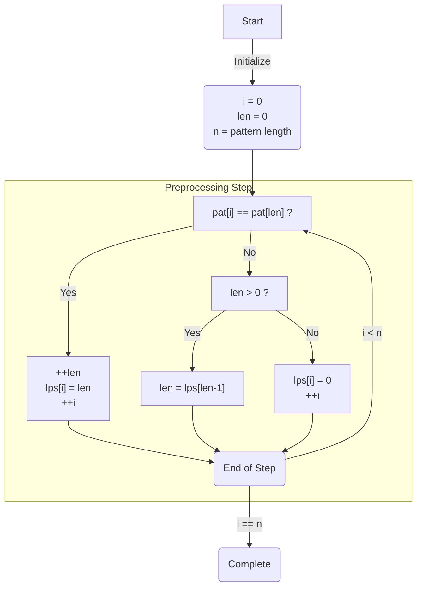

# KMP Algorithm for Pattern Searching

## Problem Description

Given a text `txt[0…n-1]` and a pattern `pat[0…m-1]`, write a function `search(char pat[], char txt[])` that prints all occurrences of `pat[]` in `txt[]`. You may assume that `n > m`.

### Examples

* **Example 1**
    * Input: `txt[] = "THIS IS A TEST TEXT", pat[] = "TEST"`
    * Output: `[10]`
* **Example 2**
    * Input: `txt[] = "AABAACAADAABAABA", pat[] = "AABA"`
    * Output: `[0, 9, 12]`

## Solution

The KMP algorithm uses degenerating property (pattern having the same sub-patterns appearing more than once) of the pattern so that it improves the _worst-case complexity_ to **O(n+m)**.

Basic idea: Whenever we detect a mismatch (after some matches), we already know some of the characters in the text of the next window. We take advantage of this information to avoid matching the characters that we know will anyway match.

### Example

`txt = "AAAAABAAABA", pat = "AAAA"`

1. Compare first window of `txt` with `pat`

    ```
    txt = "AAAAABAAABA"
           ↑
    pat = "AAAA"

    → ✅ Match found.
    ```
2. Compare next window of `txt` with `pat`

    ```
    txt = "AAAAABAAABA"
            ↑
    pat =  "AAAA"

    → ✅ We already know that the first three characters have matched. So we only need to compare the fourth A in pattern with the fourth character of the current window, skipping the first three characters.
    ```

### Preprocessing

The core issue is to know _how many characters to skip_. To know this we _pre-process_ the pattern and prepare an integer array `lps[]` that tells us the count of characters to skip.

#### Preprocessing Overview

* KMP algorithm preprocesses `pat[]` and constructs an auxiliary `lps[]` of size **m** (same as the size of the pattern) which is used to skip characters while matching.
* Name `lps` indicates the **longest proper prefix** which is also a suffix. A proper prefix is a prefix that is not the whole string. For example:
    * Prefixes of "ABC" are "", "A", "AB" and "ABC".
    * Proper prefixes of "ABC" are "", "A" and "AB".
    * Suffixes of the string are "", "C", "BC", and "ABC".
* We search for lps in sub-patterns. More clearly we focus on sub-strings of patterns that are both prefix and suffix.
* For each sub-pattern `pat[0…i]` where `i = 0 to m-1`, `lps[i]` stores the **length of the maximum matching proper prefix** which is also a suffix of the sub-pattern `pat[0…i]`.

    ```
    lps[i] = the longest proper prefix of pat[0…i]
             which is also a suffix of pat[0…i].
    ```

**Note:** `lps[i]` could also be defined as the longest prefix which is also a proper suffix. We need to use it properly in one place to make sure that the whole substring is not considered.

An example of the `lps[]` construction:

| Pattern | `lps[]` |
|---------|---------|
| `AAAAA` | `[0, 1, 2, 3]` |
| `ABCDE` | `[0, 0, 0, 0, 0]` |
| `AABAACAABAA` | `[0, 1, 0, 1, 2, 0, 1, 2, 3, 4, 5]` |
| `AAACAAAAAC` | `[0, 1, 2, 0, 1, 2, 3, 3, 3, 4]` |
| `AAABAAA` | `[0, 1, 2, 0, 1, 2, 3]` |

#### The Preprocessing Algorithm

* Calculate values in `lps[]`. We keep track of the length of the longest prefix suffix value (the `len` variable) for the previous index.
* Initialize `lps[0]` and `len` as 0.
* If `pat[len]` and `pat[i]` match, we increment `len` by 1 and assign the incremented value to `lps[i]`.
* If `pat[i]` and `pat[len]` do not match and `len` is not 0, we update `len` to `lps[len-1]`.

The flowchart is as follows:



Illustration of preprocessing: `pat[] = AAACAAAA`

```
pat[] = "AAACAAAA"

Step 0: len = 0, i = 0
    → lps[0] = 0

Step 1: len = 1, i = 2
    Since pat[len] == pat[i], do len++
    store len in lps[i], do i++
    → len = 1, lps[1] = 1, i = 2

Step 2: len = 1, i = 2
    Since pat[len] == pat[i], do len++
    store len in lps[i], do i++
    → len = 2, lps[2] = 2, i = 3

Step 3: len = 2, i = 3
    Since pat[len] != pat[i], and len > 0
    → len = lps[len-1] = lps[1] = 1

Step 4: len = 1, i = 3
    Since pat[len] != pat[i], and len > 0
    → len = lps[len-1] = lps[0] = 0

Step 5: len = 0, i = 3
    Since pat[len] != pat[i], and len == 0
    → lps[3] = 0, i = 4

Step 6: len = 0, i = 4
    Since pat[len] == pat[i], do len++
    store len in lps[i], do i++
    → len = 1, lps[4] = 1, i = 5

Step 7: len = 1, i = 5
    Since pat[len] != pat[i], and len > 0
    store len in lps[i], do i++
    → len = 2, lps[5] = 2, i = 6

Step 8: len = 2, i = 6
    Since pat[len] != pat[i], and len > 0
    store len in lps[i], do i++
    → len = 3, lps[6] = 3, i = 7

Step 9: len = 3, i = 7
    Since pat[len] != pat[i], and len > 0
    → len = lps[len-1] = lps[2] = 2

Step 10: len = 2, i = 7
    Since pat[len] != pat[i], and len > 0
    store len in lps[i], do i++
    → len = 3, lps[7] = 3, i = 8

The lps[] is as follows:
--------------------------------
 i       0  1  2  3  4  5  6  7
 lps[i]  0  1  2  0  1  2  3  3
--------------------------------
```

### The KMP Algorithm

After we complete preprocessing, we can use the `lps[]` values to decide the next characters to be matched, skipping the characters that we know will anyway match.

* Let `i = 0` and `j = 0`. We start from comparing `pat[j]` with the characters of the current window of text.
* We keep matching characters `txt[i]` and `pat[j]`, and keep incrementing `i` and `j` while `pat[j]` and `txt[i]` still match.
* When a mismatch is found:
    * We know that characters `pat[0…j-1]` match with `txt[i-j…i-1]` (Note that `j` starts with 0 and increments it only when there is a match).
    * We also know that `lps[j-1]` is the count of characters of of `pat[0…j-1]` that are both prefix and suffix.
    * From the above two points, we can conclude that we do not need to match these `lps[j-1]` characters with `txt[i-j…i-1]` because these characters will anyway match.

Here is an illustration:

```
txt[] = "AAAAABAAABA"
pat[] = "AAAA"

→ lps[] = [0, 1, 2, 3]

0. i = 0, j = 0 → txt[i] == pat[j], i++, j++
1. i = 1, j = 1 → txt[i] == pat[j], i++, j++
2. i = 2, j = 2 → txt[i] == pat[j], i++, j++
3. i = 3, j = 3 → txt[i] == pat[j], i++, j++
4. i = 4, j = 4 → Since j == M, print "pattern found" and reset j, j = lps[j-1] = lps[3] = 3
5. i = 4, j = 3 → txt[i] == pat[j], i++, j++
6. i = 5, j = 4 → Since j == M, print "pattern found" and reset j, j = lps[j-1] = lps[3] = 3
7. i = 5, j = 3 → txt[i] != pat[j], and j > 0, j = lps[j-1] = lps[2] = 2
8. i = 5, j = 2 → txt[i] != pat[j], and j > 0, j = lps[j-1] = lps[1] = 1
9. i = 5, j = 1 → txt[i] != pat[j], and j > 0, j = lps[j-1] = lps[1] = 0
10. i = 5, j = 0 → txt[i] != pat[j], i++
11. i = 6, j = 0 → txt[i] == pat[j], i++, j++
12. i = 7, j = 1 → txt[i] == pat[j], i++, j++

…………

We continue this process till there are sufficient characters in the text to be compared with the characters in the pattern.
```

## Complexity

* Time complexity: Assume that the text length is `m` and the pattern length is `n`. Since it takes `n` steps to process the `lps[]` table, and `m` steps to find the pattern, the time complexity of the KMP algorithm is **O(n+m)** in the worst case.
* Space complexity: The space complexity of the KMP algorithm is **O(n)**, where `n` is the length of the `lps[]` table that is equal to pattern length.

## Code Example

A code example written in C++ can be found in the [`main.cc`](./main.cc) file.

## References

* [GeeksForGeeks: KMP Algorithm for Pattern Searching](https://www.geeksforgeeks.org/kmp-algorithm-for-pattern-searching/)